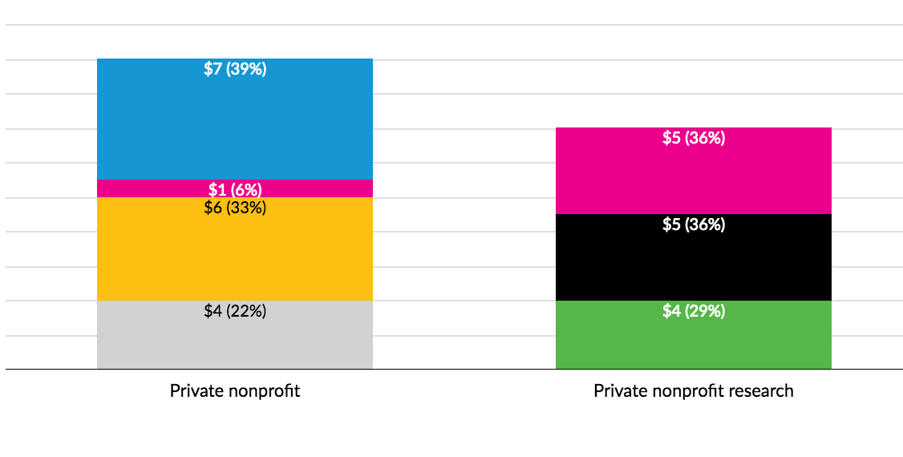
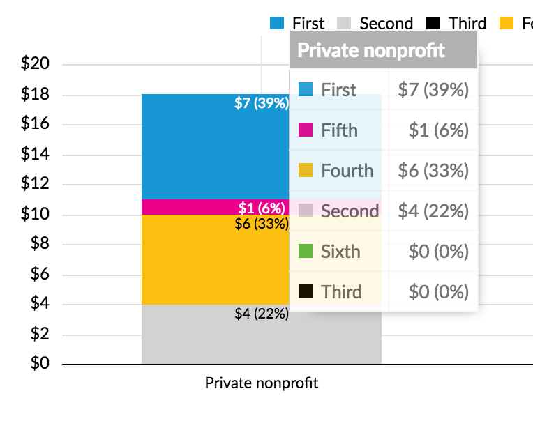
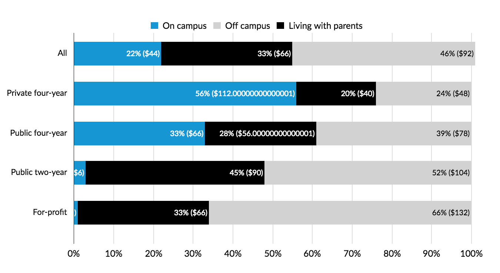

# EDITING #

## General ##

The site is made up of pages and components.  As an editor, you will mostly edit files within the /pages directory and point to elements within components to simplify certain content entry.

Note: After running *gulp*, check out /demo from the static directory for visual examples of components you can use!

### Creating a page ###

#### Site structure ####

Pages are organized by directories.  When developing, your site structure should look similar to the following:

> page1/
>> page1/page1.jsx
>> page1/page1.scss
> page2/
>> page2/page2.jsx
>> page2/page2.scss
> page3/
>> page3/page3.jsx
>> page3/page3.scss

When gulp compiles all the assets, they will be transformed to a setup that is production-friendly, similar to the following:

> page1/
>> page1/index.html
> page2/
>> page2/index.html
> page3/
>> page3/index.html

This will allow us to have URLs like urban.com/page1 and urban.com/page2 (a bit cleaner than urban.com/page1.html).

#### Adding new page ####

There is a boilerplate directory within /pages/__TEMPLATE__/ you may use as a starting point for your pages.  Copy and rename the directory to allow gulp to track the new changes.  Refer to the guidelines commented within those files.

### Adding components ###

All components are included within /components.  Unless you intend on creating a reuseable component, you shouldn't have a need to modify any contents within this directory.

To reference them for use with your page, you need to make sure you import them into your file.  Refer to the ">> Including components" for samples of how these import statements are constructed.  Once they are set, you may use them in your content (within 'singlepage' or the 'content' attribute in specifications).


### Adding Charts ###

#### Multiple formats in tooltips and labels ####

#### Case 1: Number (Percentage) ####


To add labels with a parenthetical percent, indicating the percentage of the given element to the whole series (e.g. all the stacks of stacked bar), like so:



Use the following format in the chart JSON:

```json
  "data": {
    "labels": {
      "format": "dual_$_%"
    }
  }
```

The string `dual_$_%` indicates that the nonparenthetical number should be formatted with `d3.format('$')`, and the parenthetical with `d3.format('%')`. Use any valid d3 format string.

To similarly format mouseover tooltips, like so:



```
"axis": {
    "y" : {
      "tick": {
        "format": "dual_$_%"
      }
    }
  }
```

Putting a dual format string in the axis object will not affect the axis tick marks, but it will affect the tooltips

#### Case 2: Percentage (Number) ####

For the reverse case (data in percentages, parenthetical a dollar/number/etc value), like so:



The json format strings are placed identically to those in the examples above, however the format of the string is, in this example:

```
dual_%_$_200
```

Where:

- `dual` is the key word indicating dual formatted labels or tooltips
- `%` is the string passed to `d3.format` to format the percentage
- `$` is the string passed to `d3.format` to format the value inside the parenthethical
- `200` is a scalar (can be any numeric value), which indicates the value to multiply the percentage by to get a numeric value (i.e. it is the value represented by `100%`)


## Edge cases ##

### HTML ###

In general, react components should be tolerant of most of the HTML tags in the specifications.  You can review the acceptable ones here: https://facebook.github.io/react/docs/tags-and-attributes.html

However, note the follow exceptions which may impact your code if you are porting it from a traditional source:

* *class* must be renamed to *className* as *class* is a reserved namespace in javascript (this change exists to circumvent that).
* When referencing file assets using the *a* or *img* tag, get used to pointing them using the CommonJS syntax *require()*.  For example:

```
<a href="{require('./path/to/download.pdf')}>Download Link</a>

```
Referencing the image assets should be relative to the file invoking this and webpack should be able to handle the links automatically.